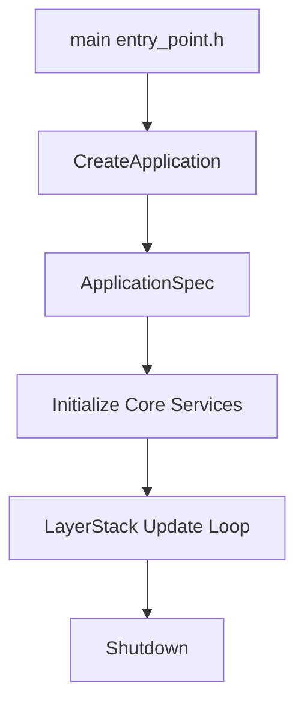

# Chained Engine Architecture

This document describes the current runtime structure of Chained Engine, from executable entry points to the main loop.

## 1. Bootstrapping Flow

The engine uses a small `main` wrapper in `entry_point.h` and delegates application construction to a per-executable `CreateApplication` function.

### Bootstrapping Diagram


### Entry Point Code Example
```cpp
// game/src/main.cpp
#include "engine/core/application.h"
#include "engine/core/entry_point.h"

namespace Chained {
    Application* CreateApplication(ApplicationCommandLineArgs args) {
        ApplicationSpecification spec;
        spec.Name = "Chained Game";
        spec.WindowWidth = 1600;
        spec.WindowHeight = 900;
        
        return new Application(spec);
    }
}
```

### Project Selection and Discovery
Startup usually follows this path:
1. `CreateApplication` fills `ApplicationSpecification` from CLI args and default window settings.
2. `Application` is constructed and initializes core services.
3. Runtime-specific startup may discover or load a project through `Project::Discover` and `Project::Load`.
4. The executable attaches either `EditorLayer` or `RuntimeLayer`.

## 2. System Initialization

Initialization is centralized in `Application`. That keeps startup predictable, but it also makes `Application` a coupling point for unrelated systems.

### What `Application` Owns
`Application` currently creates and coordinates the window, `ThreadPool`, `ComponentSerializer`, `AssetManager`, `Renderer`, `TextureSystem`, `Audio`, `PhysicsSystem`, `UIRenderer`, and `ScriptEngine`.

### Current Tradeoff
This is not a pure SRP split. The benefit is that bootstrap order is explicit. The cost is that changes to service lifecycle, headless mode, or renderer setup tend to ripple through `Application`.

## 3. Layer Stack Model

The engine uses a `LayerStack` for gameplay and editor/runtime behavior.

1. `EditorLayer` or `RuntimeLayer` owns the primary experience.
2. `ImGuiLayer` is pushed as an overlay in non-headless runs.
3. Layers rely on shared process-wide services through `ServiceLocator` and `Application::Get()`.

## 4. Main Loop

`Application::Run()` drives the frame loop:
1. Update timing and frame delta.
2. Poll input and platform events.
3. Tick engine services.
4. Run fixed-step updates on the layer stack.
5. Run per-frame layer updates.
6. Render scene layers, then render ImGui, then present the frame.

## 5. Architectural Pressure Points

The current shape works, but it has a few clear friction points:
1. Service lifecycle order is encoded in registration order, which is easy to break.
2. Runtime and editor logic both reach back into global state instead of depending on explicit interfaces.
3. Entry-point setup and runtime project loading both interpret CLI and project configuration, which duplicates startup policy.
4. `Application` owns too many unrelated concerns, so it is the main place where startup regressions accumulate.

> [!NOTE]
> Recent architectural improvements include the move of core gameplay logic (like Scene Transitions) into native C++ systems to reduce managed overhead and improve predictability.
